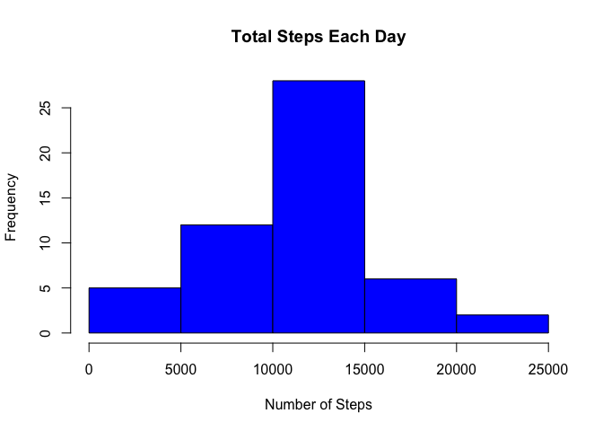
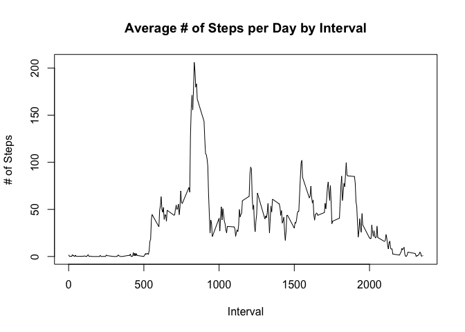
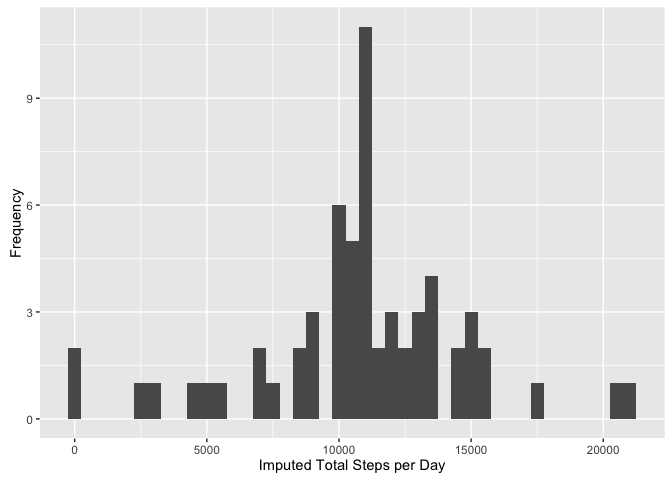
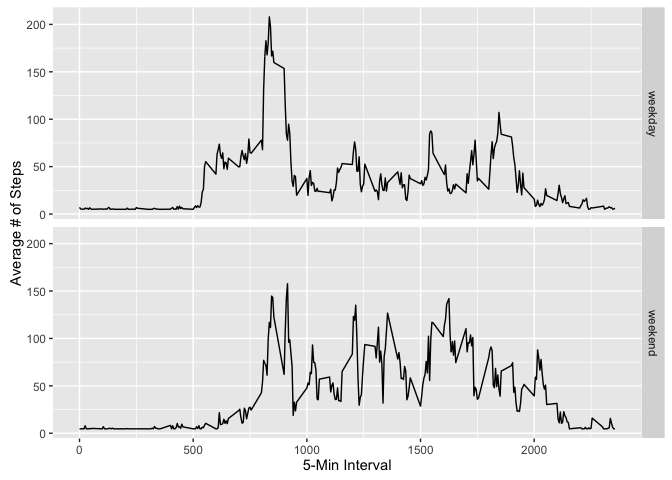

# Reproducible Research: Peer Assessment 1

## Getting set up

```r
library(knitr)
library(ggplot2)
library(scales)
library(Hmisc)
```

```
## Loading required package: lattice
```

```
## Loading required package: survival
```

```
## Loading required package: Formula
```

```
## 
## Attaching package: 'Hmisc'
```

```
## The following objects are masked from 'package:base':
## 
##     format.pval, round.POSIXt, trunc.POSIXt, units
```

```r
opts_chunk$set(echo = TRUE, results = 'hold')
```

## Loading and preprocessing the data

```r
# Assume that activity.zip is present.
if(!file.exists('activity.csv')){
    unzip('activity.zip')
}
data <- read.csv('activity.csv')
```


## What is mean total number of steps taken per day?  
##### Histogram of the total number of steps taken each day  
##### Mean and median number of steps taken each day  

```r
dailySteps <- aggregate(steps ~ date, data, sum)
hist(dailySteps$steps, main = paste("Total Steps Each Day"), col="blue", xlab="Number of Steps")
```

<!-- -->

```r
dailyMean <- mean(dailySteps$steps)
dailyMedian <- median(dailySteps$steps)
```
- The `mean` is 1.0766189\times 10^{4} and the `median` is 10765.

## What is the average daily activity pattern?
##### Time series plot of the average number of steps taken

```r
intervalSteps <- aggregate(steps ~ interval, data, mean)

plot(intervalSteps$interval,intervalSteps$steps, type="l", xlab="Interval", ylab="# of Steps",main="Average # of Steps per Day by Interval")
```

<!-- -->

```r
maximumInterval <- intervalSteps[which.max(intervalSteps$steps),1]
```

##### The 5-minute interval that, on average, contains the maximum number of steps  

- Interval with maximum number of steps: 835


## Imputing missing values
##### Calculate and report the total number of missing values in the dataset (i.e. the total number of rows with 𝙽𝙰s)

```r
numMissingValues <- sum(is.na(data$steps))
```
- Number of missing values: 2304  

##### Devise a strategy for filling in all of the missing values in the dataset
##### Create a new dataset that is equal to the original dataset but with the missing data filled in

```r
# http://stackoverflow.com/questions/20273070/function-to-impute-missing-value
dataImpute <- data
dataImpute$steps <- impute(data$steps, fun=mean)
```

##### Make a histogram of the total number of steps taken each day and Calculate and report the mean and median total number of steps taken per day  

```r
imputedDailySteps <- tapply(dataImpute$steps, dataImpute$date, sum)
qplot(imputedDailySteps, xlab="Imputed Total Steps per Day", ylab="Frequency", binwidth=500)
```

<!-- -->

##### Do these values differ from the estimates from the first part of the assignment?
- No  


```r
imputedDailyStepsMean <- mean(imputedDailySteps)
imputedDailyStepsMedian <- median(imputedDailySteps)
```
- Imputed Mean: 1.0766189\times 10^{4}
- Imputed Median:  1.0766189\times 10^{4}
- Mean: 1.0766189\times 10^{4}
- Median is 10765.  

##### What is the impact of imputing missing data on the estimates of the total daily number of steps?  
- No, the values do not differ from the estimates at the beginning of the assignment


## Are there differences in activity patterns between weekdays and weekends?  
##### Create a new factor variable in the dataset with two levels – “weekday” and “weekend” indicating whether a given date is a weekday or weekend day  

```r
dataImpute$dateType <-  ifelse(as.POSIXlt(dataImpute$date)$wday %in% c(0,6), 'weekend', 'weekday')
```
##### Make a panel plot containing a time series plot (i.e. 𝚝𝚢𝚙𝚎 = "𝚕") of the 5-minute interval (x-axis) and the average number of steps taken, averaged across all weekday days or weekend days (y-axis).

```r
averagedDataImputed <- aggregate(steps ~ interval + dateType, data=dataImpute, mean)
ggplot(averagedDataImputed, aes(interval, steps)) + 
    geom_line() + 
    facet_grid(dateType ~ .) +
    xlab("5-Min Interval") + 
    ylab("Average # of Steps")
```

<!-- -->

- Overall more activity on the weekends  
- Earlier peak activityon weekdays
